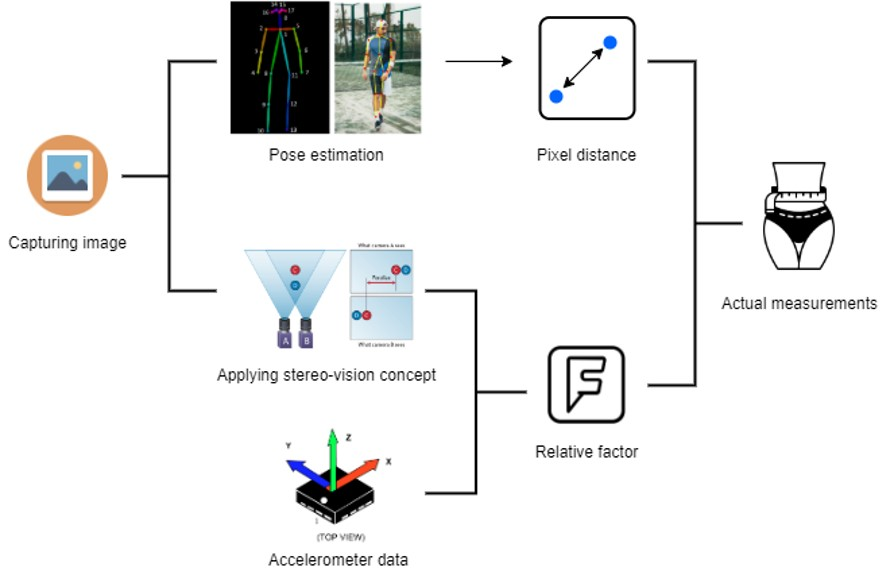
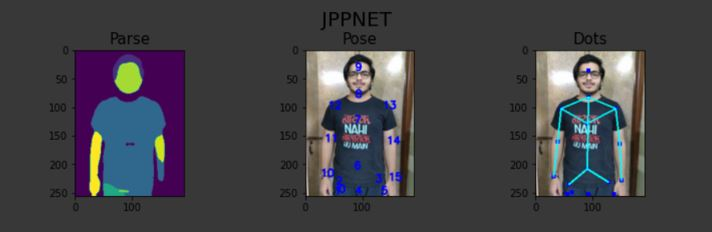
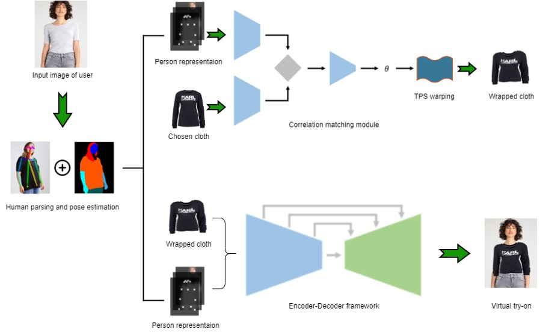
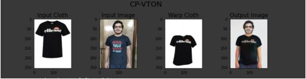

# Team-NITRiders

This repository is made for **Myntra HackerRamp: Campus Edition** on the theme of **Experience**.

Participants:

  - [Santanu Senapati](https://github.com/KSSSenapati)
  - [Arnab Paikaray](https://github.com/arnabGudu)
  - [Ishaan Desai](https://github.com/IshaanDesai45)

E-Commerce sites are becoming highly popular for fashion and trends nowadays, but every year it tends to bear higher losses because of increasing returns, reverse pickup cost, and product verification cost. The product doesn’t meet expectations when not tried in person or bought by viewing catalogs because of ill-fitting of clothes due to size chart parity across different brands. Increased returns result in added costs and that ultimately leads to lagging back in competition among other E-Commerce sites. To tackle with this problem we have proposed a [solution](https://github.com/arnabGudu/nitriders_myntra/blob/main/Round_1/NITRourkela_NITRiders.pptx).

Our idea mainly focuses on two major things: **Size Estimation** and **Virtual Try-ON** which would surely improve an user's experience while surfing through different products on an online fashion store. These two techniques have been successfully implemented in an Web-App whose front-end is built using **React JS** framework and python based **Flask** framework is being used for backend. 

The UI have been built in such a manner that it would be completely hassle free for an user to make use of these two methods. The overall design of the web-app and the proposed solution is explained in detail in this [video](https://github.com/arnabGudu/nitriders_myntra/blob/main/Round_2/NITRourkela_NITRiders.mp4).

## Size Estimation

We are predicting the measurements of an user from his/her photo in the following manner.

Here, for pose estimation we use JPP-Net. The image given below shows the result of JPP-Net applied on user's photo.

In-depth explanation about the size prediction is covered in this [video](https://github.com/arnabGudu/nitriders_myntra/blob/main/Round_2/NITRourkela_NITRiders_demo_2.mp4).

## Virtual Try-ON

In this part, we are first wrapping the selected cloth in the manner of the dress worn by the user in that photo and then fitting it over his/her image in order to give a feeling of virtual try-on. The first part is called as **GMM(Geometric Matching Module)** and the second part is **TOM(Try-ON Module)**. The below diagram is the flow chart of our implementation.

For fitting the wrapped cloth over the user, we are using CP-VTON model which is an encoder-decoder framework. The result of this model is obtained as follows.

The comprehensive description about this part is explained in this [video](https://github.com/arnabGudu/nitriders_myntra/blob/main/Round_2/NITRourkela_NITRiders_demo_3.mp4).

**The above discussed methods are also integrated along with the web-app. The demo working of the complete procedure is shown [here](https://github.com/arnabGudu/nitriders_myntra/blob/main/Round_2/NITRourkela_NITRiders_demo.mp4).**
